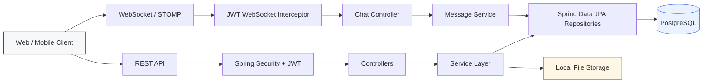

# Tribesy Social Backend

<p align="center">
  <strong>Modern social network backend built with Java & Spring Boot</strong>
</p>

<p align="center">
  
  
  
  
  
</p>

Tribesy is a backend for a social networking application where users can create posts, build a following network, exchange real-time messages and manage their profiles.

The project was built to practice real-world backend development with **Spring Boot, Spring Security, JPA/Hibernate, PostgreSQL and WebSocket communication**.

---

## ✨ What this project demonstrates

- **JWT-based authentication** with stateless Spring Security
- **Role-based authorization** with `USER` / `ADMIN` roles
- **Password hashing** with BCrypt
- **REST API** organized into controllers, services, repositories and DTOs
- **Post feed** with pagination
- **Follow / unfollow** relationships and personalized feed generation
- **Real-time chat** using WebSocket + STOMP + SockJS
- **WebSocket authentication** using the same JWT mechanism
- **Chat history** and direct conversations
- **File upload** with unique generated filenames
- **PostgreSQL persistence** with Spring Data JPA / Hibernate
- **Transactional service layer** with read-only transactions where appropriate
- **DTO-based API contracts** instead of exposing the whole domain model

---

## 🧱 Architecture



### Project structure

```text
src/main/java/com/tribesy/social
├── config/          # Spring MVC, WebSocket and application configuration
├── controller/      # REST and WebSocket endpoints
├── dto/             # Request / response models
├── entity/          # JPA entities
├── repository/      # Spring Data repositories
├── security/        # JWT authentication and WebSocket security
└── service/         # Business logic
```

The code follows a classic **Controller → Service → Repository** structure, keeping HTTP/WebSocket transport logic separate from business rules and persistence.

---

## 🚀 Core functionality

### 🔐 Authentication & Security

`/api/v1/auth`

- User registration
- Login with username + password
- BCrypt password hashing
- JWT token generation
- Stateless authentication
- Role-based authorization for admin endpoints
- JWT validation for WebSocket connections

Authenticated REST requests use:

```http
Authorization: Bearer <jwt-token>
```

---

### 👤 Users & Social Graph

`/api/v1/users`

Users can:

- Search for other users
- View profiles
- Update their own profile
- Follow / unfollow users
- View followers
- View following

The social graph is stored separately through the `Follow` entity with a unique constraint on `(follower_id, following_id)`.

---

### 📝 Posts & Feed

`/api/v1/posts`

- Create posts
- Retrieve a paginated list of posts
- Retrieve a personalized feed based on followed users
- Sort posts by creation time

Example:

```http
GET /api/v1/posts?page=0&size=10
GET /api/v1/posts/feed?page=0&size=10
```

Pagination is implemented with Spring Data's `Pageable` abstraction and returned through a dedicated `PageResponse` DTO.

---

### 💬 Real-time Chat

The project supports both regular HTTP messaging and real-time communication.

**WebSocket endpoint:**

```text
/ws
```

**STOMP message destination:**

```text
/app/chat.sendMessage
```

**Chat subscription:**

```text
/topic/chat/{chatId}
```

Messages are persisted in PostgreSQL and then broadcast to connected subscribers through Spring's `SimpMessagingTemplate`.

The WebSocket connection is authenticated by passing the JWT token in the STOMP `CONNECT` frame:

```text
Authorization: Bearer <jwt-token>
```

---

### 📁 File Uploads

`/api/v1/files/upload`

- Multipart file upload
- UUID-based filenames
- Local filesystem storage
- Basic path traversal protection
- Public resource mapping under `/uploads/**`

---

## 🛠 Tech Stack

| Technology | Purpose |
|---|---|
| **Java 21** | Application language |
| **Spring Boot** | Backend framework |
| **Spring MVC** | REST API |
| **Spring Security** | Authentication & authorization |
| **JWT (JJWT)** | Stateless authentication |
| **Spring Data JPA** | Data access |
| **Hibernate** | ORM |
| **PostgreSQL** | Relational database |
| **WebSocket + STOMP** | Real-time messaging |
| **SockJS** | WebSocket fallback support |
| **Lombok** | Boilerplate reduction |
| **Maven** | Build & dependency management |
| **Jakarta Validation** | Request validation |

---

## 📡 REST API Overview

| Area | Method | Endpoint | Auth |
|---|:---:|---|:---:|
| Auth | `POST` | `/api/v1/auth/register` | — |
| Auth | `POST` | `/api/v1/auth/login` | — |
| Users | `GET` | `/api/v1/users/search?query={query}` | ✅ |
| Users | `GET` | `/api/v1/users/me` | ✅ |
| Users | `GET` | `/api/v1/users/{username}` | ✅ |
| Users | `PATCH` | `/api/v1/users/me` | ✅ |
| Users | `POST` | `/api/v1/users/{username}/follow` | ✅ |
| Users | `DELETE` | `/api/v1/users/{username}/follow` | ✅ |
| Users | `GET` | `/api/v1/users/{username}/followers` | ✅ |
| Users | `GET` | `/api/v1/users/{username}/following` | ✅ |
| Admin | `GET` | `/api/v1/users/admin/all` | 🔐 ADMIN |
| Posts | `POST` | `/api/v1/posts` | ✅ |
| Posts | `GET` | `/api/v1/posts?page=0&size=10` | ✅ |
| Posts | `GET` | `/api/v1/posts/feed?page=0&size=10` | ✅ |
| Chats | `GET` | `/api/v1/chats` | ✅ |
| Chats | `POST` | `/api/v1/chats/send` | ✅ |
| Messages | `GET` | `/api/v1/messages/history/{chatId}` | ✅ |
| Files | `POST` | `/api/v1/files/upload` | ✅ |

---

## ▶️ Getting Started

### Requirements

- **Java 21+**
- **PostgreSQL**
- **Maven** (or use the included Maven Wrapper)

### 1. Clone the repository

```bash
git clone <your-repository-url>
cd tribesy-backend
```

### 2. Create the database

Create a PostgreSQL database:

```sql
CREATE DATABASE tribesy_db;
```

The current project configuration expects PostgreSQL on port `5433`.

### 3. Configure application properties

Update `src/main/resources/application.properties` for your local environment:

```properties
spring.datasource.url=jdbc:postgresql://localhost:5433/tribesy_db
spring.datasource.username=<your-db-user>
spring.datasource.password=<your-db-password>

jwt.secret=<your-base64-secret>
jwt.expiration-ms=86400000

app.upload.dir=uploads
```

> **Security note:** credentials and JWT secrets should be provided through environment variables or an external configuration in real deployments. Do not commit real secrets to Git.

### 4. Run the application

Using Maven Wrapper:

```bash
./mvnw spring-boot:run
```

On Windows:

```powershell
mvnw.cmd spring-boot:run
```

The application starts as a Spring Boot web service and exposes the REST API together with the `/ws` WebSocket endpoint.

---

## 🧪 Testing

Run the test suite with:

```bash
./mvnw test
```

The project currently includes a Spring Boot application-context smoke test. The test suite is a natural area for further expansion with controller, service and repository tests.

---

## 🔍 Example Authentication Flow

### Register

```http
POST /api/v1/auth/register
Content-Type: application/json

{
  "username": "john",
  "email": "john@example.com",
  "password": "strong-password",
  "avatarUrl": null,
  "bio": "Java developer"
}
```

### Login

```http
POST /api/v1/auth/login
Content-Type: application/json

{
  "username": "john",
  "password": "strong-password"
}
```

The response contains a JWT token that can be used for authenticated API requests.

---

## 💡 Engineering Decisions

### Stateless authentication

The API uses JWT authentication with `SessionCreationPolicy.STATELESS`, which keeps the backend independent from server-side HTTP sessions.

### Separation of concerns

Controllers handle transport-level concerns, services contain business logic, and repositories are responsible for persistence. DTOs isolate the API contract from JPA entities.

### Transaction boundaries

Business operations that modify multiple entities are wrapped in `@Transactional`, while read-only operations use `@Transactional(readOnly = true)` where appropriate.

### Database pagination

Post feeds use database-level pagination through Spring Data rather than loading the complete dataset into memory.

### WebSocket authorization

The WebSocket handshake is followed by STOMP-level JWT authentication. Message sending also verifies that the authenticated user is a participant of the target chat before persisting the message.

---

## 📌 Roadmap

- [ ] Add comprehensive unit and integration tests
- [ ] Add API documentation with OpenAPI / Swagger
- [ ] Move secrets fully to environment-based configuration
- [ ] Add Docker / Docker Compose setup
- [ ] Add refresh tokens and token revocation strategy
- [ ] Add message read/unread handling
- [ ] Add richer post media support
- [ ] Add CI pipeline for build and tests

---

## 👨‍💻 About the Project

This project is a **portfolio backend project for demonstrating practical Java backend development skills**.

It focuses on writing a structured Spring application with authentication, relational data modeling, REST APIs, transactions and real-time communication rather than implementing a simple CRUD example.

---

<p align="center">
  <sub>Built with Java ❤️ and Spring Boot</sub>
</p>
